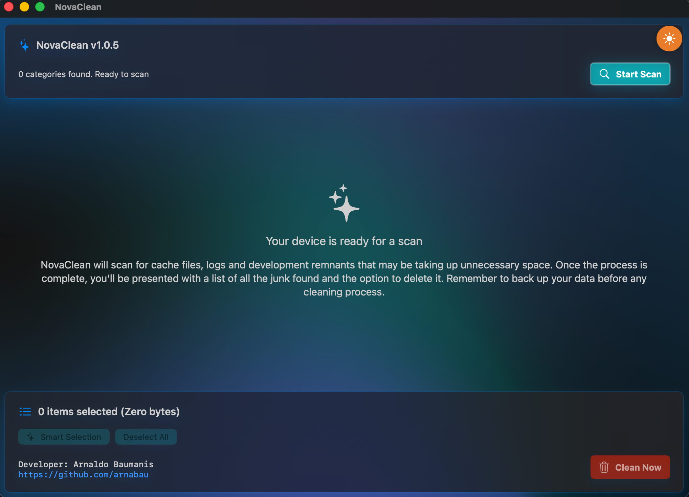
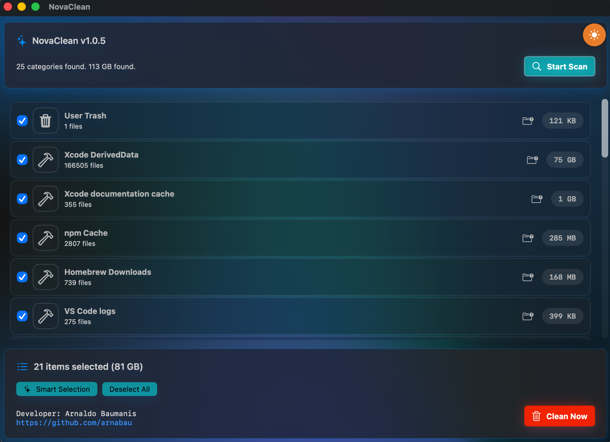
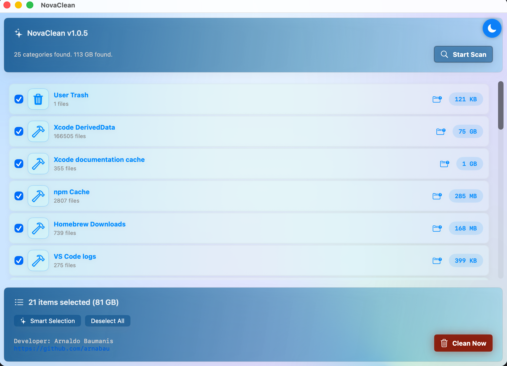
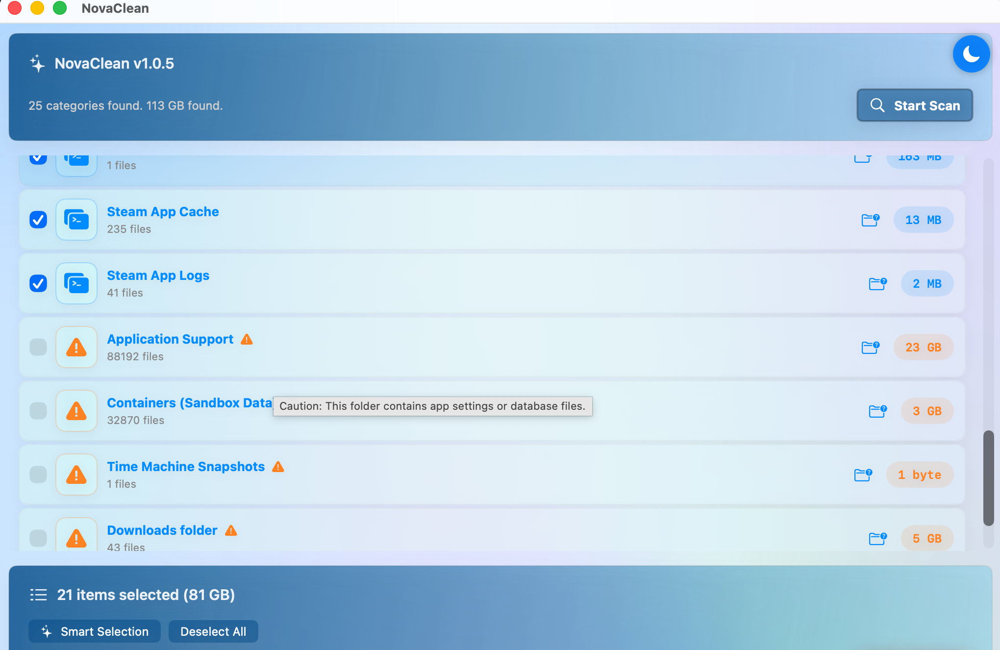

# NovaClean 🧹 ✨

NovaClean is a fully-functional modern, lightweight, and high-performance system cleaning utility designed exclusively for macOS. Built with **SwiftUI**, it offers a premium glassmorphic interface to keep your Mac lean, fast, and free of unnecessary junk.

NovaClean uses safety-first defaults: path validation, protected-directory rules, conservative cleanup boundaries, and explicit confirmation for higher-risk actions. When risk or uncertainty is high, NovaClean skips, refuses, or requires stronger confirmation rather than broadening deletion scope.

## 🚀 Key Features

- **Deep System Scan**: Identifies cache files, logs, and temporary data using a high-speed streaming engine.
- **Smart Junk Definitions**: Powered by an external JSON-based architecture for safe and precise file identification.
- **Dynamic Theming**: Fully responsive Light and Dark modes with custom-tailored color palettes and glassmorphic cards.
- **Safe-by-Design**: Implements Path Sanitization to protect critical system directories.
- **Localization**: Implements localization. English and Spanish so far.

## 🏗 Architecture & Technology

NovaClean follows the **MVVM (Model-View-ViewModel)** architectural pattern, ensuring a clean (architecture) separation of concerns:

- **View Layer**: Pure SwiftUI using the latest `@State`, `@Environment`, and `AnyShapeStyle` for a reactive UI.
- **Service Layer (`FileSystemService`)**: A robust engine handling file system operations, AppleScript execution for elevated privileges, and asynchronous scanning.
- **Data Layer**: JSON-driven junk definitions allowing for easy updates without recompiling the core engine.

<p align="center">
  
  
  
  
</p>

### Highlights:
- **Streaming Scan**: Doesn't block the UI thread, providing real-time feedback to the user.
- **Security-First**: Uses `ConfigurationRepository` to prevent directory traversal attacks or accidental deletion of system files.
- **Native Performance**: Zero third-party dependencies. Built entirely with Apple's native frameworks.

## 📸 Interface

The UI leverages **Glassmorphism** and **Material effects** to blend perfectly with the macOS aesthetic. Each card adapts its visual weight using `AnyShapeStyle` to provide depth in Dark Mode and clarity in Light Mode.

## 🛠 Installation

1. **GUI Installation (Recommended)**

1. Download and open the DMG
2. Drag NovaClean.app to /Applications/
3. Launch the app

Done!

2. Clone the repository:
   ```bash
   git clone [https://github.com/arnabau/NovaClean.git](https://github.com/arnabau/NovaClean.git)

It's still a work in progress, but you can already try the app or contribute to its future

## ¿Do you like NovaClean?

If you found it helpful, consider buying me a coffee ☕ to motivate me to keep it up:

[<image-card alt="Buy Me a Coffee" src="https://img.shields.io/badge/Buy%20Me%20a%20Coffee-FFDD00?style=for-the-badge&logo=buy-me-a-coffee&logoColor=black" ></image-card>](https://buymeacoffee.com/stringsandbits)
